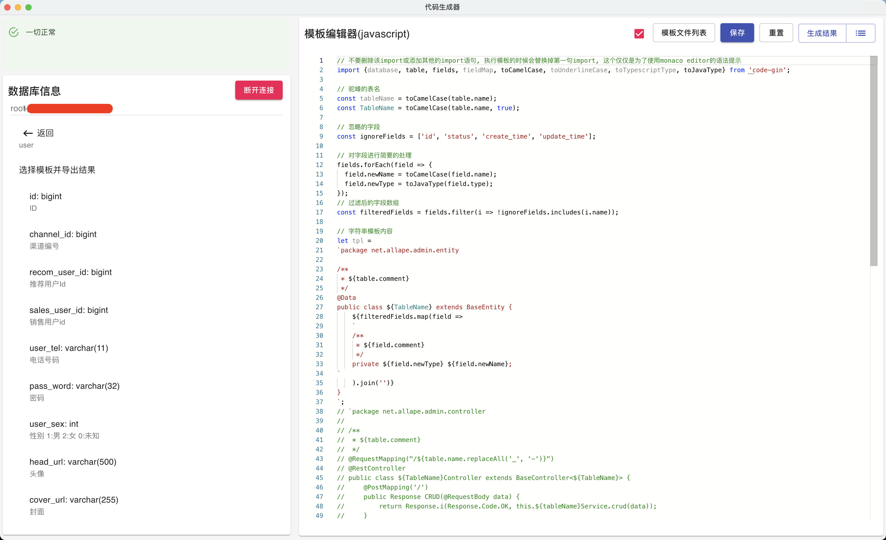
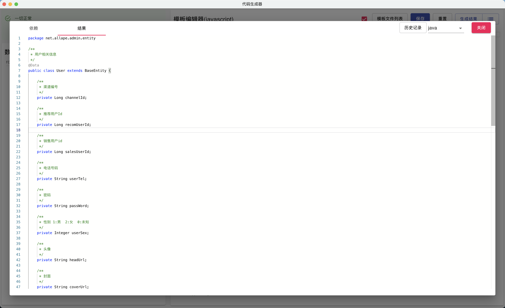

#  CodeGin | 代码生成器 | Code Generator

### 截图 | Screenshots




### 技术栈 | Specs
- [react](https://reactjs.org/)
- [typescript](http://typescriptlang.org/)
- [monaco-editor](https://github.com/microsoft/monaco-editor)
- [electron-js](https://www.electronjs.org/)
- [mysql](https://www.mysql.com/)
- [golang](https://golang.org/)

### 开发必要工具 | Environments
- [git](https://git-scm.com/)
- [nodejs](https://nodejs.org/)
- [golang](https://golang.org/)

#### react
```shell
cd react-app

# 开发启动 | Start
npm start

# 生产启动, 需要在electron环境下 | Start for electron usage
npm run-script start-production

# 打包 | Build
npm build
```

#### electron js
```shell
cd electron-js

# 启动前准备 | Prepares before start
# MacOS
npm run-script macos-start-prepare
# Windows
npm run-script windows-start-prepare

# 正常启动 | Start
npm start
# 调试页面启动 | Start for web debug
npm run-script start-web

# MacOS 打包 | Build for MacOS on MacOS(cross platform build is explained in electron-packager doc)
npm run-script pack-macos

# Windows 打包 | Build for Windows on windows
npm run-script pack-windows

# 其他平台打包参考文档 | Build for another platforms
# https://github.com/electron/electron-packager
# 显示打包帮助内容 | Display electron-packager manual
./node_modules/.bin/electron-packager --help
# 或 | or
# electron-packager --help # npm install -g electron-packager
# 或 | or
# node ./node_modules/.bin/electron-packager --help

# MacOS图标生成参考/resources/png2icns.sh
```

#### golang
```shell
cd golang
# 运行go | Run go app cli
go run main.go $(base64 <<< '{"username":...}') $(base64 <<< SQL) $(base64 <<< arg1) $(base64 <<< arg2) $(base64 <<< arg3) ...

# 打包 | Build
# https://stackoverflow.com/questions/20728767/all-possible-goos-value
# https://github.com/golang/go/commit/1eebb91a5828c26532125b9464c92f721cd79d0f

# (打包 | Build for) MacOS x64
rm -Rf ./go-app
GOOS=darwin GOARCH=amd64 go build -o go-app main.go
```
